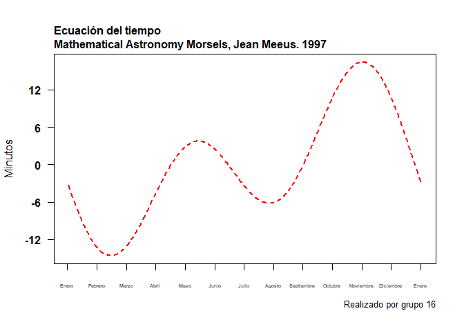

TAREA 02
================
Grupo 16
24/11/2021

<p style="font-family: times, serif; font-size:50pt; font-style:italic">
Tarea 02
</p>

> **Integrantes**
>
> — *Campos Torres Sergio Junior*
>
> — *Montero Navarro Adrian*
>
> — *Pinedo Cienfuegos Diana Melissa*


***1. ¿Qué cantidad de dinero sobra al repartir 10000$ entre 3
personas?***

``` r
10000%%3
```

    ## [1] 1

***2. ¿Es el número 4560 divisible por 3?***

``` r
0== 4560%%3
```

    ## [1] TRUE

***3. Construya un vector con los números enteros del 2 al 87. ¿Cuáles
de esos números son divisibles por 7?***

``` r
input = 2:87
multiplo_7 = (input %% 7) == 0
input[multiplo_7]
```

    ##  [1]  7 14 21 28 35 42 49 56 63 70 77 84

***4. Construya dos vectores, el primero con los números enteros desde 7
hasta 3, el segundo vector con los primeros cinco números positivos
divisibles por 5.***

*-Sea A la condición de ser par en el primer vector.*

*-Sea B la condición de ser mayor que 10 en el segundo vector.*

*-¿En cuál de las 5 posiciones se cumple A y B simultáneamente?*

``` r
X <- c(3:7)
Y <- c(1:5*5)
input = X
A = (X %% 2) == 0
input[A]
```

    ## [1] 4 6

``` r
Y[Y > 10]
```

    ## [1] 15 20 25

``` r
Z <- c(input[A],Y[Y >10])
min(which(Z>10 & (Z %% 2) == 0))
```

    ## [1] 4

***5. Consulte este link en el cual hay una anéctoda de Gauss niño. Use
R para obtener el resultado de la suma solicitada por el profesor del
niño Gauss.***

``` r
sum(seq(1:100))
```

    ## [1] 5050

``` r
Gauss <- function(x) {
(x*(x+1))/2
} 
Gauss(100)
```

    ## [1] 5050

***6. Construya un vector con los siguientes elementos: 1, -4, 5, 9, -4.
Escriba un procedimiento para extraer las posiciones donde está el valor
mínimo en el vector.***

``` r
A <- c(1, -4, 5, 9, -4)
which(A==min(A))
```

    ## [1] 2 5

***7. Calcular 8!***

``` r
factorial(8)
```

    ## [1] 40320

***8. Evaluar la siguiente sumatoria***


``` r
ocho<-function(i){
  (exp(i))
}
sum(ocho(3:7)) 
```

    ## [1] 1723.159

***9. Evaluar la siguiente productoria***


``` r
1/2*log(c(1:10),10)
```

    ##  [1] 0.0000000 0.1505150 0.2385606 0.3010300 0.3494850 0.3890756 0.4225490
    ##  [8] 0.4515450 0.4771213 0.5000000

``` r
M <- 1/2*log(c(1:10),10)
prod(M)
```

    ## [1] 0

***10. Realizar una función que permita calcular el área de una corona
circular.*** 

``` r
#Área sombreada: 1/2Rs - 1/2cd

areacorona<-function(R,s,c,d){
  0.5*(R*s-c*d)
}
```

***11. Construya un vector cualquiera e inviertalo, es decir, que el
primer elemento quede de último, el segundo de penúltimo y así
sucesivamente. Compare su resultado con el de la función rev***

``` r
V5 <- seq(0,25,5)
V5invert <- c(25,20,15,10,5,0)
rev(V5)
```

    ## [1] 25 20 15 10  5  0

***12. Calcular lo siguiente***


``` r
probl12<-function(i){
  (i^3+4*i^2)
}
sum(probl12(10:100)) 
```

    ## [1] 26852735

***13. Calcular lo siguiente P25***


``` r
problem13<-function(i){
  (2^(i)/i)+(3^(i)/i^(2))
}
sum(problem13(1:25))
```

    ## [1] 2129170437

***14. Lea el siguiente archivo***

*a. Calcular el número de variables del datase*

``` r
Paises <- read.delim("https://raw.githubusercontent.com/fhernanb/datos/master/Paises.txt")
ncol(Paises)
```

    ## [1] 5

*b. ¿Cuántos países hay en el dataset?*

``` r
nrow(Paises)
```

    ## [1] 107

*c. ¿Cuál es el país con mayor población?*

``` r
Paises$Pais[match(max(Paises$poblacion),Paises$poblacion)]
```

    ## [1] "China_"

*d. ¿Cuál es el país con alfabetización más baja?*

``` r
Paises$Pais[match(min(Paises$alfabetizacion), Paises$alfabetizacion)]
```

    ## [1] "Burkina_Faso"

***15. En R hay unas bases de datos incluídas, una de ellas es la base
de datos llamada mtcars. Para conocer las variables que están en mtcars
usted puede escribir en la consola ?mtcars o también help(mtcars). De la
base mtcars obtenga bases de datos que cumplan las siguientes
condiciones.***

*a. Autos que tengan un rendimiento menor a 18 millas por galón de
combustible.*

``` r
mtcars[(mtcars$mpg<18),]
```

    ##                      mpg cyl  disp  hp drat    wt  qsec vs am gear carb
    ## Duster 360          14.3   8 360.0 245 3.21 3.570 15.84  0  0    3    4
    ## Merc 280C           17.8   6 167.6 123 3.92 3.440 18.90  1  0    4    4
    ## Merc 450SE          16.4   8 275.8 180 3.07 4.070 17.40  0  0    3    3
    ## Merc 450SL          17.3   8 275.8 180 3.07 3.730 17.60  0  0    3    3
    ## Merc 450SLC         15.2   8 275.8 180 3.07 3.780 18.00  0  0    3    3
    ## Cadillac Fleetwood  10.4   8 472.0 205 2.93 5.250 17.98  0  0    3    4
    ## Lincoln Continental 10.4   8 460.0 215 3.00 5.424 17.82  0  0    3    4
    ## Chrysler Imperial   14.7   8 440.0 230 3.23 5.345 17.42  0  0    3    4
    ## Dodge Challenger    15.5   8 318.0 150 2.76 3.520 16.87  0  0    3    2
    ## AMC Javelin         15.2   8 304.0 150 3.15 3.435 17.30  0  0    3    2
    ## Camaro Z28          13.3   8 350.0 245 3.73 3.840 15.41  0  0    3    4
    ## Ford Pantera L      15.8   8 351.0 264 4.22 3.170 14.50  0  1    5    4
    ## Maserati Bora       15.0   8 301.0 335 3.54 3.570 14.60  0  1    5    8

``` r
X <- mtcars[(mtcars$mpg<18),]
row.names(X)
```

    ##  [1] "Duster 360"          "Merc 280C"           "Merc 450SE"         
    ##  [4] "Merc 450SL"          "Merc 450SLC"         "Cadillac Fleetwood" 
    ##  [7] "Lincoln Continental" "Chrysler Imperial"   "Dodge Challenger"   
    ## [10] "AMC Javelin"         "Camaro Z28"          "Ford Pantera L"     
    ## [13] "Maserati Bora"

*b. Autos que tengan 4 cilindros.*

``` r
mtcars[(mtcars$cyl == 4),]
```

    ##                 mpg cyl  disp  hp drat    wt  qsec vs am gear carb
    ## Datsun 710     22.8   4 108.0  93 3.85 2.320 18.61  1  1    4    1
    ## Merc 240D      24.4   4 146.7  62 3.69 3.190 20.00  1  0    4    2
    ## Merc 230       22.8   4 140.8  95 3.92 3.150 22.90  1  0    4    2
    ## Fiat 128       32.4   4  78.7  66 4.08 2.200 19.47  1  1    4    1
    ## Honda Civic    30.4   4  75.7  52 4.93 1.615 18.52  1  1    4    2
    ## Toyota Corolla 33.9   4  71.1  65 4.22 1.835 19.90  1  1    4    1
    ## Toyota Corona  21.5   4 120.1  97 3.70 2.465 20.01  1  0    3    1
    ## Fiat X1-9      27.3   4  79.0  66 4.08 1.935 18.90  1  1    4    1
    ## Porsche 914-2  26.0   4 120.3  91 4.43 2.140 16.70  0  1    5    2
    ## Lotus Europa   30.4   4  95.1 113 3.77 1.513 16.90  1  1    5    2
    ## Volvo 142E     21.4   4 121.0 109 4.11 2.780 18.60  1  1    4    2

``` r
Y <- mtcars[(mtcars$cyl == 4),]
row.names(Y)
```

    ##  [1] "Datsun 710"     "Merc 240D"      "Merc 230"       "Fiat 128"      
    ##  [5] "Honda Civic"    "Toyota Corolla" "Toyota Corona"  "Fiat X1-9"     
    ##  [9] "Porsche 914-2"  "Lotus Europa"   "Volvo 142E"

*c. Autos que pesen más de 2500 libras y tengan transmisión manual.*

``` r
mtcars[(mtcars$wt>2.500 & mtcars$am==1),]
```

    ##                 mpg cyl disp  hp drat    wt  qsec vs am gear carb
    ## Mazda RX4      21.0   6  160 110 3.90 2.620 16.46  0  1    4    4
    ## Mazda RX4 Wag  21.0   6  160 110 3.90 2.875 17.02  0  1    4    4
    ## Ford Pantera L 15.8   8  351 264 4.22 3.170 14.50  0  1    5    4
    ## Ferrari Dino   19.7   6  145 175 3.62 2.770 15.50  0  1    5    6
    ## Maserati Bora  15.0   8  301 335 3.54 3.570 14.60  0  1    5    8
    ## Volvo 142E     21.4   4  121 109 4.11 2.780 18.60  1  1    4    2

``` r
Z <- mtcars[(mtcars$wt>2.500 & mtcars$am==1),]
row.names(Z)
```

    ## [1] "Mazda RX4"      "Mazda RX4 Wag"  "Ford Pantera L" "Ferrari Dino"  
    ## [5] "Maserati Bora"  "Volvo 142E"

***16. La ecuación de tiempo es la diferencia entre el tiempo solar
medio y el tiempo solar aparente (Referencia). Si bien esta varía, la
forma analítica de esta ecuación se muestra a continuación (Usar x como
un rango de 0 a 365). Replicar el gráfico::***


``` r
x=c(0:365)
y=c(2*pi*(x-81)/365)
fy=c(9.87*sin(2*y)-7.53*cos(y)-1.5*sin(y))
plot(fy, type="l",lty="33",lwd="2", axes=TRUE, las=1, pch=20, yaxp=c(-12,18,5),xaxp = c(0, 365, 12),xaxt="n", xlab="", ylab="Minutos", col="red", font=2)

title(main="Ecuación del tiempo
Mathematical Astronomy Morsels, Jean Meeus. 1997", adj=0, line=0.5, cex.main=1)
title(sub="Realizado por grupo 16", adj=1, line = 2.5, cex.sub=0.8)

axis(1, at = seq(0, 365, by=30.4),
     labels = c("Enero","Febrero","Marzo","Abril","Mayo","Junio","Julio","Agosto","Septiembre","Octubre","Noviembre","Diciembre","Enero"), cex.axis=0.45)
```

<!-- -->
