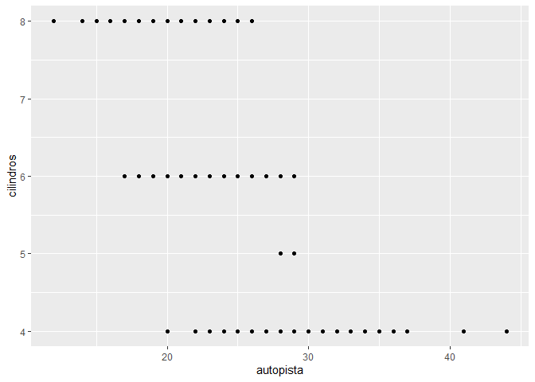
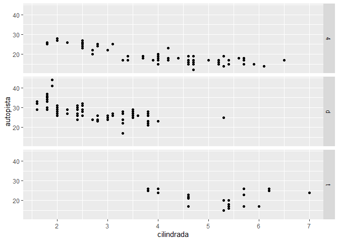
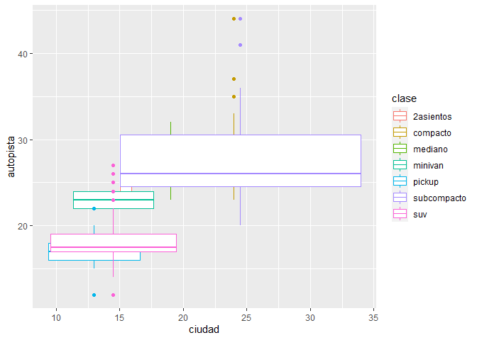

Tarea 04
================
Campos Torres Sergio Junior
20/1/2022

> **Integrantes**
>
> — *Campos Torres Sergio Junior*
>
> — *Pinedo Cienfuegos Diana Melissa*

**Usamos las librerias necesarias**

``` r
library(ggplot2)
library(datos)
library(tidyverse)
```

    ## -- Attaching packages --------------------------------------- tidyverse 1.3.1 --

    ## v tibble  3.1.6     v dplyr   1.0.7
    ## v tidyr   1.1.4     v stringr 1.4.0
    ## v readr   2.1.0     v forcats 0.5.1
    ## v purrr   0.3.4

    ## -- Conflicts ------------------------------------------ tidyverse_conflicts() --
    ## x dplyr::filter() masks stats::filter()
    ## x dplyr::lag()    masks stats::lag()

**PARTE 1: Ggplot base**

**a. Ejecuta ggplot(data = millas). ¿Qué observas?**

``` r
ggplot(data = millas)
```

<!-- -->

``` r
#A pesar de utilizar una data como resultado solo se observa un espacio en blanco
```

**b. ¿Cuántas filas hay en millas? ¿Cuántas columnas?**

*Para filas*

``` r
count(millas)
```

    ## # A tibble: 1 x 1
    ##       n
    ##   <int>
    ## 1   234

*Para columnas*

``` r
length(millas)
```

    ## [1] 11

**c. ¿Qué describe la variable traccion? Lee la ayuda de ?millas para
encontrar la respuesta.**

``` r
?millas
```

    ## starting httpd help server ... done

``` r
#Dicha variable describe el tipo de tracción existente en el vehículo, el tipo de potencia se divide en d = delantera, t = trasera, 4 = 4 ruedas
```

**d. Realiza un gráfico de dispersión de autopista versus cilindros.**

``` r
ggplot(data=millas)+
  geom_point(aes(autopista, cilindros))
```

<!-- -->

**e. ¿Qué sucede cuando haces un gráfico de dispersión (scatterplot) de
clase versus traccion? ¿Por qué no es útil este gráfico?**

``` r
ggplot(data=millas)+
  geom_point(aes(clase, traccion))
```

<!-- -->

``` r
#El gráfico no es útil ya que "traccion" es una variable categorica y no numerica continua; no se representará bien los datos en el gráfico de dispersión que hace uso de los ejes coordenados
```

**PARTE 2: Mapeos estéticos**

**a. ¿Qué no va bien en este código? ¿Por qué hay puntos que no son
azules?**

``` r
 ggplot(data = millas) +
   geom_point(mapping = aes(x = cilindrada, y = autopista, color = "blue"))
```

<!-- -->

``` r
#La opcion de "color" se encuentra dentro de la función aes() y se cuenta como una variable más. Para utilizarlo como una función estetica, va por separado de la función que contiene la columna de datos; es decir, debe ir fuera de aes(). Para ello tenemos el siguiente ejemplo:

ggplot(data = millas) +
 geom_point(mapping = aes(x = cilindrada, y = autopista), color = "blue")
```

<!-- -->

**b. ¿Qué variables en millas son categóricas? ¿Qué variables son
continuas? (Pista: escribe ?millas para leer la documentación de ayuda
para este conjunto de datos). ¿Cómo puedes ver esta información cuando
ejecutas millas?**

``` r
#Las variables categoricas son: fabricante, modelo, transmisión, tracción, combustible, clase

#La variable continua: cilindrada, anio, autopista

#En la base de datos de millas se puede denotar en en la columna de datos a que variable pertenecen
```

**c. Asigna una variable continua a color, size, y shape. ¿Cómo se
comportan estas estéticas de manera diferente para variables categóricas
y variables continuas?**

``` r
#COLOR:
#En en caso de variables categoricas, en la leyenda se encuentran cada dato de la variable asignados con un color diferente. Para las variables continuas, se le asigna una gradiente de color en intervalos de los datos.

ggplot(data = millas) + 
  geom_point(mapping = aes(x = cilindrada, y = autopista, color = clase))
```

<!-- -->

``` r
ggplot(data = millas) +
 geom_point(mapping = aes(x = cilindrada, y = autopista, color = anio))
```

<!-- -->

``` r
#SIZE:
#En en caso de variables categóricas, se obtiene un tamaño distinto para cada dato sin relación entre ellas. Ppara variables continuas, podremos ver relación entre el tamaño y el dato de la variables, por ser una estética ordenada.

ggplot(data = millas) +
 geom_point(mapping = aes(x = cilindrada, y = autopista, size = clase))
```

    ## Warning: Using size for a discrete variable is not advised.

<!-- -->

``` r
ggplot(data = millas) +
 geom_point(mapping = aes(x = cilindrada, y = autopista, size = anio))
```

<!-- -->

``` r
#SHAPE:
#Para variables categóricas, obtendremos seis formas distintas para cada variables, para el resto se deja un espacio en blanco. Para las variables continuas, no se puede manejar un máximo de seis valores discretos, por lo tanto no se puede plotear.

ggplot(data = millas) +
 geom_point(mapping = aes(x = cilindrada, y = autopista, shape = clase))
```

    ## Warning: The shape palette can deal with a maximum of 6 discrete values because
    ## more than 6 becomes difficult to discriminate; you have 7. Consider
    ## specifying shapes manually if you must have them.

    ## Warning: Removed 62 rows containing missing values (geom_point).

<!-- -->

**d. ¿Qué ocurre si asignas o mapeas la misma variable a múltiples
estéticas?**

``` r
ggplot(data = millas) +
 geom_point(mapping = aes(x = autopista, y = autopista, color= autopista))
```

<!-- -->

``` r
#Dependiendo de la variable elegida se forma una función identidad y las variables esteticas tambien van en funcion a la variable
```

**e. ¿Qué hace la estética stroke? ¿Con qué formas trabaja? (Pista:
consulta ?geom_point)**

``` r
#stroke: Modifica el tamaño o ancho del borde

ggplot(data = millas) + 
  geom_point(mapping = aes(x = clase, y = cilindros, stroke = cilindrada))
```

<!-- -->

``` r
#Trabaja solo con variables continuas.
```

**f. ¿Qué ocurre si se asigna o mapea una estética a algo diferente del
nombre de una variable, como aes(color = cilindrada \< 5)?**

``` r
 ggplot(data = millas) +
   geom_point(mapping = aes(x = cilindrada, y = autopista, color = cilindrada < 5))
```

<!-- -->

``` r
#Cuando asignas se asigna una condicion, se crea una leyenda con dos colores, uno si es que se cumple (TRUE) y otro si es que no se cumple (FALSE)
```

**PARTE 3: Facetas**

**a. ¿Qué ocurre si intentas separar en facetas una variable continua?**

``` r
ggplot(data = millas) +
  geom_point(mapping = aes(x = cilindrada, y = autopista)) +
  facet_wrap(~ cilindrada)
```

<!-- -->

``` r
#*Según el ejemplo las facetas(sub-gráficos que muestran cada uno un subconjunto de los datos) se dividen en cada valor que puede tomar la variable elegida
```

**b. ¿Qué significan las celdas vacías que aparecen en el gráfico
generado usando facet_grid(traccion \~ cilindros)? ¿Cómo se relacionan
con este gráfico?**

``` r
ggplot(data = millas) +
  geom_point(mapping = aes(x = cilindrada, y = autopista)) +
  facet_grid(traccion ~ cilindros)
```

<!-- -->

``` r
#*En el segundo gráfico no hay variables adicionales que condicionan su distribución en la tabla

#El gráfico es separado según las combinaciones de dos variables, las celdas vacías representan que hay casos donde no se cumplen las dos variables.
```

**c. ¿Qué grafica el siguiente código? ¿Qué hace . ?**

``` r
ggplot(data = millas) +
  geom_point(mapping = aes(x = cilindrada, y = autopista)) +
  facet_grid(traccion ~ .)
```

<!-- -->

``` r
ggplot(data = millas) +
  geom_point(mapping = aes(x = cilindrada, y = autopista)) +
  facet_grid(. ~ cilindros)
```

<!-- -->

``` r
#Si se prefiere no separar en facetas las filas o columnas, reemplaza por una . el nombre de alguna de las variables
```

**d. Mira de nuevo el primer gráfico en facetas presentado en esta
sección:**

``` r
ggplot(data = millas) +
  geom_point(mapping = aes(x = cilindrada, y = autopista)) +
  facet_wrap(~ clase, nrow = 2)
```

<!-- -->

**¿Cuáles son las ventajas de separar en facetas en lugar de aplicar una
estética de color?¿Cuáles son las desventajas?**

``` r
#La ventaja que presenta el emplear "facetas" es que nos pueden mostrar subconjuntos de los datos que se tienen, es decir, dividen el gráfico; una desventaja podria ser no vizualizarse de manera precisa los intervalos de las coordenadas y no se ve a simple vista la relación que tienen con cada variable.
```

**¿Cómo cambiaría este balance si tuvieras un conjunto de datos más
grande? - Lee ?facet_wrap**

``` r
#Si el conjunto de datos crece, los detalles para cada subconjunto va disminuyendo, se tendria una vista más general mas no se efectivo para un analisis detallado
```

**¿Qué hace nrow? ¿Qué hace ncol? ¿Qué otras opciones controlan el
diseño de los paneles individuales?**

``` r
#Por un lado, nrow cumple la función de señalar la cantidad de filas que hay en la gráfica. En cambio, ncol cumple la función de señalar la cantidad de columnas que hay en la gráfica.
```

**¿Por qué facet_grid() no tiene argumentos nrow y ncol?**

``` r
#En el caso de faced_grid() no tiene argumentos nrow y ncol ya que en su reemplazo se emplea row  y cols respectivamente.
```

**Cuando usas facet_grid(), generalmente deberías poner la variable con
un mayor número de niveles únicos en las columnas. ¿Por qué?**

``` r
#De esa manera el gráfico que este brinda es mucho más amplio y fácil de entender.
```

**PARTE 4: Objetos geométricos**

**a.¿Qué geom usarías para generar un gráfico de líneas? ¿Y para un
diagrama de caja? ¿Y para un histograma? ¿Y para un gráfico de área?**

``` r
#Linea = geom_line()
#Cajas = geom_boxplot() 
#Histograma = geom_histogram()
#Area = geom_area()
```

**b.Ejecuta este código en tu mente y predice cómo se verá el output.
Luego, ejecuta el código en R y verifica tus predicciones.**

``` r
#Se generara un grafico con la data millas, el eje x estara en funcion de la cilindrada y el eje y a la autopista, el color sera en base a la traccion, se veran puntos y un suavizado

ggplot(data = millas, mapping = aes(x = cilindrada, y = autopista, color = traccion)) +
  geom_point() +
  geom_smooth(se = FALSE)
```

    ## `geom_smooth()` using method = 'loess' and formula 'y ~ x'

<!-- -->

**c.¿Qué muestra show.legend = FALSE? ¿Qué pasa si lo quitas? ¿Por qué
crees que lo utilizamos antes en el capítulo?**

``` r
#Decide si se visualiza o no la leyenda, cuando se usa “FALSE” esta no se visualizará, en caso no sea utilizado, el valor por defecto es el de TRUE, en el ejercicio se uso porque no se queria visualizar la leyenda en el grafico.
```

**d.¿Qué hace el argumento se en geom_smooth()?**

``` r
#Crea un suavizado en el gráfico.
```

**e.¿Se verán distintos estos gráficos? ¿Por qué sí o por qué no?**

``` r
ggplot(data = millas, mapping = aes(x = cilindrada, y = autopista)) +
  geom_point() +
  geom_smooth()
```

    ## `geom_smooth()` using method = 'loess' and formula 'y ~ x'

<!-- -->

``` r
ggplot() +
  geom_point(data = millas, mapping = aes(x = cilindrada, y = autopista)) +
  geom_smooth(data = millas, mapping = aes(x = cilindrada, y = autopista))
```

    ## `geom_smooth()` using method = 'loess' and formula 'y ~ x'

<!-- -->

``` r
#No se ven distintos, cuando la data no va puesta en la funcion inicial (ggplot), tiene que ir en las que modifican la funcion ggplot (geom_point y geom_smooth en este caso)
```

**f.Recrea el código R necesario para generar los siguientes gráficos**

``` r
ggplot(data = millas, mapping = aes(x = cilindrada, y = autopista)) +
  geom_point() +
  geom_smooth(se = FALSE)
```

    ## `geom_smooth()` using method = 'loess' and formula 'y ~ x'

<!-- -->

``` r
ggplot(data = millas, mapping = aes(x = cilindrada, y = autopista, group = traccion)) +
  geom_point() +
  geom_smooth(se = FALSE)
```

    ## `geom_smooth()` using method = 'loess' and formula 'y ~ x'

<!-- -->

``` r
ggplot(data = millas, mapping = aes(x = cilindrada, y = autopista, color = traccion)) +
  geom_smooth(se = FALSE) + geom_point()
```

    ## `geom_smooth()` using method = 'loess' and formula 'y ~ x'

<!-- -->

``` r
ggplot(data = millas, mapping = aes(x = cilindrada, y = autopista)) +
  geom_point(mapping = aes(x = cilindrada, y = autopista, color = traccion)) +
  geom_smooth(mapping = aes(x = cilindrada, y = autopista, linetype = traccion), se = FALSE)
```

    ## `geom_smooth()` using method = 'loess' and formula 'y ~ x'

<!-- -->

``` r
ggplot(data = millas, mapping = aes(x = cilindrada, y = autopista, color = traccion)) +
  geom_point(colour = "white", size = 5) +
  geom_point(aes(colour = factor(traccion)), size = 2)
```

<!-- -->

**PARTE 5: Gráficos estadísticos**

**a.¿Cuál es el geom predeterminado asociado con stat_summary()? ¿Cómo
podrías reescribir el gráfico anterior para usar esa función geom en
lugar de la función stat?**

``` r
#Funcion anterior
ggplot(data = diamantes) +
  stat_summary(mapping = aes(x = corte, y = profundidad),
    fun.min = min,
    fun.max = max,
    fun = median)
```

<!-- -->

``` r
#Nueva funcion
ggplot(data = diamantes) +
  geom_pointrange(mapping = aes(x = corte, y = profundidad),
                  stat = "summary",
                  fun.min = min,
                  fun.max = max,
                  fun = median)
```

<!-- -->

**b.¿Qué hace geom_col()? ¿En qué se diferencia de geom_bar()?**

``` r
#geom_bar() hace que la altura de la barra sea proporcional al número de casos de cada grupo
#geom_col() hace que las alturas de las barras representen valores en los datos
```

**d.¿Qué variables calcula stat_smooth()? ¿Qué parámetros controlan su
comportamiento?**

``` r
#Calcula el y (el valor predecido), ymin (valor mínimo del intervalo de confianza) e ymax (valor máximo del intervalo de confianza)

#Los parametros son method, formula, method.arg, na.rm)
```

**e.En nuestro gráfico de barras de proporción necesitamos establecer
group = 1. ¿Por qué? En otras palabras, ¿cuál es el problema con estos
dos gráficos?**

``` r
#Sin el group = 1 las proporciones son calculadas para cada barra

ggplot(data = diamantes) +
  geom_bar(mapping = aes(x = corte, y = ..prop..))
```

<!-- -->

``` r
ggplot(data = diamantes) +
  geom_bar(mapping = aes(x = corte, fill = color, y = ..prop..))
```

<!-- -->

``` r
#Con el group = 1 las proporciones son calculadas para todas las barras

ggplot(data = diamantes) +
  geom_bar(mapping = aes(x = corte, y = ..prop.., group = 1))
```

<!-- -->

**PARTE 6: Ajuste de posición**

**a.¿Cuál es el problema con este gráfico? ¿Cómo podrías mejorarlo?**

``` r
ggplot(data = millas, mapping = aes(x = ciudad, y = autopista)) +
  geom_point()
```

<!-- -->

``` r
#Se ve que los puntos se superponen, para eso usamos = "jitter" para que se vean mejor los puntos

ggplot(data = millas, mapping = aes(x = ciudad, y = autopista)) +
  geom_point(position = "jitter")
```

<!-- -->

**b.¿Qué parámetros de geom_jitter() controlan la cantidad de ruido?**

``` r
ggplot(data = millas, mapping = aes(x = ciudad, y = autopista)) +
  geom_jitter(width = 0)
```

<!-- -->

``` r
ggplot(data = millas, mapping = aes(x = ciudad, y = autopista)) +
  geom_jitter(width = 20)
```

<!-- -->

``` r
ggplot(data = millas, mapping = aes(x = ciudad, y = autopista)) +
  geom_jitter(height = 0)
```

<!-- -->

``` r
ggplot(data = millas, mapping = aes(x = ciudad, y = autopista)) +
  geom_jitter(height = 20)
```

<!-- -->

**c.Compara y contrasta geom_jitter() con geom_count()**

``` r
ggplot(data = millas, mapping = aes(x = ciudad, y = autopista)) +
  geom_jitter()
```

<!-- -->

``` r
ggplot(data = millas, mapping = aes(x = ciudad, y = autopista)) +
  geom_count()
```

<!-- -->

``` r
ggplot(data = millas, mapping = aes(x = ciudad, y = autopista, color = clase)) +
  geom_count(position = "jitter")
```

<!-- -->

**d.¿Cuál es el ajuste de posición predeterminado de geom_boxplot()?
Crea una visualización del conjunto de datos de millas que lo
demuestre.**

``` r
ggplot(data = millas, mapping = aes(x = ciudad, y = autopista, color = clase)) +
  geom_boxplot()
```

<!-- -->

``` r
ggplot(data = millas, mapping = aes(x = ciudad, y = autopista, color = clase)) +
  geom_boxplot(position = "identity")
```

<!-- -->

**PARTE 7: Sistema de coordenadas**

**a.Convierte un gráfico de barras apiladas en un gráfico circular
usando coord_polar().**

``` r
ggplot(millas, aes(x = factor(1), fill = traccion)) +
  geom_bar()
```

<!-- -->

``` r
ggplot(millas, aes(x = factor(1), fill = traccion)) +
  geom_bar(width = 1) +
  coord_polar(theta = "y")
```

<!-- -->

**b.¿Qué hace labs()? Lee la documentación.**

``` r
ggplot(data = mpg, mapping = aes(x = class, y = hwy)) +
  geom_boxplot() +
  coord_flip() +
  labs(y = "Millas por galón de combustible en autopista",
       x = "Tipo de auto",
       title = "Datos de economía de combustible",
       subtitle = "1999-2008",
       caption = "Fuente: http://fueleconomy.gov")
```

<!-- -->

**c.¿Cuál es la diferencia entre coord_quickmap() y coord_map()?**

``` r
#coord_map() proyecta una porción de la tierra, que es aproximadamente esférica, sobre un plano 2D utilizando cualquier proyección definida por el paquete mapproj. Las proyecciones de mapas no conservan, en general, las líneas rectas, por lo que esto requiere un cálculo considerable. coord_quickmap() es una aproximación rápida que sí conserva las líneas rectas. Funciona mejor para áreas pequeñas más cercanas al ecuador.
```

**d.¿Qué te dice la gráfica siguiente sobre la relación entre ciudad y
autopista? ¿Por qué es coord_fixed() importante? ¿Qué hace
geom_abline()?**

``` r
ggplot(data = millas, mapping = aes(x = ciudad, y = autopista)) +
  geom_point() +
  geom_abline() +
  coord_fixed()
```

<!-- -->
