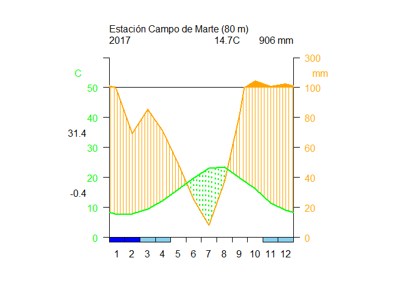
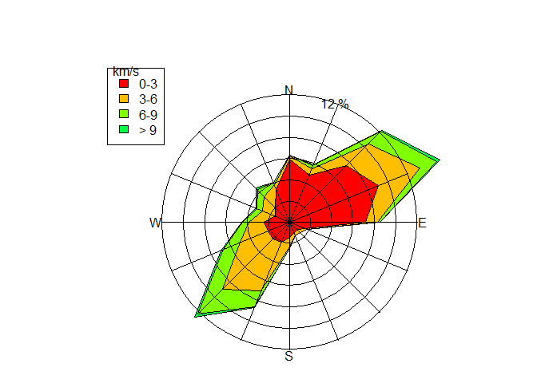
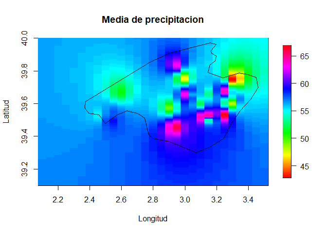

TRABAJO CLIMATOL
================
Campos Torres Sergio Junior
29/1/2022

**Librerias a utilizar**

``` r
library(sp)
library(fields)
```

    ## Loading required package: spam

    ## Spam version 2.8-0 (2022-01-05) is loaded.
    ## Type 'help( Spam)' or 'demo( spam)' for a short introduction 
    ## and overview of this package.
    ## Help for individual functions is also obtained by adding the
    ## suffix '.spam' to the function name, e.g. 'help( chol.spam)'.

    ## 
    ## Attaching package: 'spam'

    ## The following objects are masked from 'package:base':
    ## 
    ##     backsolve, forwardsolve

    ## Loading required package: viridis

    ## Loading required package: viridisLite

    ## 
    ## Try help(fields) to get started.

``` r
library(raster)
library(gstat)
library(ncdf4)
library(climatol)
```

    ## Loading required package: maps

    ## 
    ## Attaching package: 'maps'

    ## The following object is masked from 'package:viridis':
    ## 
    ##     unemp

    ## Loading required package: mapdata

``` r
library(maps)
library(mapdata)
```

**NIVEL 1**

*1. Generar un diagrama de Walter y Lieth con la data de datcli, este
debe llevar de título “Estación Campo de Marte”, a una altitud de 80
msnm durante el año 2017, con los meses simbolizados por números. Las
temperaturas deberán visualizarse de color verde; las precipitaciones,
en naranja; los meses de congelación segura, en azul y los de
congelación probable, en celeste. No trazar una línea suplementaria de
precipitación.*

``` r
#Usamos la data datcli
data(datcli)
diagwl(datcli, est="Estación Campo de Marte", alt=80, per="2017", mlab="other", tcol="green", pcol="orange", sfcol="blue", pfcol="sky blue") 
```

<!-- -->

*2.Recrea minuciosamente el siguiente diagrama de la rosa de los vientos
(pista: col=rainbow(8)).*

``` r
#La funcion a utilizar es "rosavent", usando f1 en ella nos muestra un ejemplo con la data "windfr" implementada en climatol
data(windfr)
rosavent(windfr, fnum=6, fint=2, flab=1, ang=pi/2.6, uni="km/s", col=rainbow(8))
```

<!-- -->

**NIVEL 2**

*3. Convertir la data diaria de tmax en una data de medias mensuales.
Posteriormente, homogeneizar dichos datos mensuales con una
normalización por estandarización y gráficos de medias anuales y
correcciones aplicadas en el análisis exploratorio de datos (utilizar
dos decimales).*

``` r
#Primero establecemos nuestra carpeta con la funcion setwd
setwd("D:/Programacion Ciclo 3/Tarea Climatol")

#Data diaria Tmax:
data(tmax)

#Datas de medias mensuales:
write.table(dat, "Tmax_2001-2003.dat", row.names=FALSE, col.names=FALSE)
write.table(est.c, "Tmax_2001-2003.est", row.names=FALSE, col.names=FALSE)

#Climatol ayuda a obtener datos mensuales mediante la función dd2m
dd2m('Tmax', 2001, 2003, ndec=2, valm=2)
```

    ##   1  2  3
    ## 
    ## Monthly mean values saved to file Tmax-m_2001-2003.dat 
    ##   (Months with more than 10 missing original daily data
    ##   have also been set to missing)

``` r
#Esta orden guarda en Tmax_2001-2003.dat y Tmax_2001-2003.est las series mensuales, listas para ser homogeneizadas

#Homogeneizamos dichos datos mensuales
homogen('Tmax', 2001, 2003, std=3, gp=3, ndec=2, suf='m', nm=12)
```

    ## 
    ## HOMOGEN() APPLICATION OUTPUT  (From R's contributed package 'climatol' 3.1.1)
    ## 
    ## =========== Homogenization of Tmax, 2001-2003. (Sat Jan 29 15:47:49 2022)
    ## 
    ## Parameters: varcli=Tmax anyi=2001 anyf=2003 suf=m nm=12 nref=10,10,4 std=3 swa=NA ndec=2 dz.max=5 dz.min=-5 wd=0,0,100 snht1=25 snht2=25 tol=0.02 maxdif=0.005 mxdif=0.005 maxite=999 force=FALSE wz=0.001 trf=0 mndat=NA gp=3 ini=NA na.strings=NA vmin=NA vmax=NA nclust=100 cutlev=NA grdcol=#666666 mapcol=#666666 hires=TRUE expl=FALSE metad=FALSE sufbrk=m tinc=NA tz=UTC cex=1.2 verb=TRUE
    ## 
    ## Data matrix: 36 data x 3 stations

    ## Computing inter-station distances:  1  2
    ## 
    ## 
    ## ========== STAGE 1 (SNHT on overlapping temporal windows) ===========

    ## Computation of missing data with outlier removal
    ## (Suggested data replacements are provisional)
    ##   Station(rank) Date: Observed -> Suggested (Anomaly, in std. devs.)
    ## (No detected outliers)
    ## 
    ## Performing shift analysis on the 3 series...
    ## 
    ## 
    ## ========== STAGE 2 (SNHT on the whole series) =======================

    ## Computation of missing data with outlier removal
    ## (Suggested data replacements are provisional)
    ##   Station(rank) Date: Observed -> Suggested (Anomaly, in std. devs.)
    ## (No detected outliers)
    ## 
    ## Performing shift analysis on the 3 series...

    ## 
    ## 
    ## ========== STAGE 3 (Final computation of all missing data) ==========
    ## 
    ## Computing inter-station weights... (done)

    ## Computation of missing data with outlier removal
    ## (Suggested data replacements are provisional)
    ## 
    ## The following lines will have one of these formats:
    ##   Station(rank) Date: Observed -> Suggested (Anomaly, in std. devs.)
    ##   Iteration Max.data.difference (Station_code)
    ## 2  (S02)
    ## 
    ## Last series readjustment (please, be patient...)

    ## 
    ## ======== End of the homogenization process, after 0.26 secs 
    ## 
    ## ----------- Final computations:
    ## 
    ## ACmx: Station maximum absolute autocorrelations of anomalies
    ##    Min. 1st Qu.  Median    Mean 3rd Qu.    Max. 
    ##  0.1900  0.2100  0.2300  0.2233  0.2400  0.2500 
    ## 
    ## SNHT: Standard normal homogeneity test (on anomaly series)
    ##    Min. 1st Qu.  Median    Mean 3rd Qu.    Max. 
    ##    2.40    2.80    3.20    4.50    5.55    7.90 
    ## 
    ## RMSE: Root mean squared error of the estimated data
    ##    Min. 1st Qu.  Median    Mean 3rd Qu.    Max. 
    ##   1.691   1.721   1.752   1.778   1.821   1.891 
    ## 
    ## POD: Percentage of original data
    ##    Min. 1st Qu.  Median    Mean 3rd Qu.    Max. 
    ##    91.0    92.5    94.0    94.0    95.5    97.0 
    ## 
    ##   ACmx SNHT RMSE POD Code Name     
    ## 1 0.19 7.9  1.7  91  S01  La Vall  
    ## 2 0.23 2.4  1.9  94  S02  Lucent   
    ## 3 0.25 3.2  1.8  97  S03  Sunflower

    ## 
    ## ----------- Generated output files: -------------------------
    ## 
    ## Tmax_2001-2003.txt :  This text output 
    ## Tmax_2001-2003_out.csv :  List of corrected outliers 
    ## Tmax_2001-2003_brk.csv :  List of corrected breaks 
    ## Tmax_2001-2003.pdf :  Diagnostic graphics 
    ## Tmax_2001-2003.rda :  Homogenization results. Postprocess with (examples):
    ##    dahstat('Tmax',2001,2003) #get averages in file Tmax_2001-2003-me.csv 
    ##    dahstat('Tmax',2001,2003,stat='tnd') #get OLS trends and their p-values 
    ##    dahgrid('Tmax',2001,2003,grid=YOURGRID) #get homogenized grids 
    ##    ... (See other options in the package documentation)

*4. Recortar la data mensual de Ptest desde 1965 hasta 2005.
Homogeneizar dicha data mediante clústers o áreas rectangulares, con un
ancho de superposición de 0, mediante una estandarización y con gráficos
de totales anuales en el análisis exploratorio de datos. Mostrar las
medias de las series homogeneizadas en un archivo Excel que, además,
mencione los totales anuales y los datos de la latitud, longitud y
nombre de cada estación (utilizar dos decimales).*

``` r
#Igual que el ejercicio anterior pero ahora con la data Ptest
data(Ptest)
write.table(dat, "Ptest_1951-2010.dat", row.names=FALSE, col.names=FALSE)
write.table(est.c, "Ptest_1951-2010.est", row.names=FALSE, col.names=FALSE)

#Recortamos la data
datsubset('Ptest', 1951, 2010, 1965, 2005)
```

    ## Subset data written to files Ptest_1965-2005.dat and Ptest_1965-2005.est

``` r
#Homogeneizar mediante areas rectangulares:
homogsplit('Ptest', 1965, 2005, xc=2, yc=39, 0, 0, nm=12, std=3, ndec=2, gp=4, expl=TRUE)
```

    ## 
    ## HOMOGSPLIT() APPLICATION OUTPUT  (From R's contributed package 'climatol' 3.1.1)
    ## 
    ## =========== Homogenization of Ptest, 1965-2005. (Sat Jan 29 15:47:50 2022)
    ## 
    ## Parameters: varcli=Ptest anyi=1965 anyf=2005 xc=2 yc=39 xo=0 yo=0 maponly=FALSE suf=NA nm=12 nref=10,10,4 swa=NA std=3 ndec=2 dz.max=5 dz.min=-5 wd=0,0,100 snht1=25 snht2=25 tol=0.02 maxdif=NA mxdif=NA force=FALSE wz=0.001 trf=0 mndat=NA gp=4 ini=NA na.strings=NA maxite=999 vmin=NA vmax=NA nclust=100 grdcol=#666666 mapcol=#666666 hires=TRUE expl=TRUE metad=FALSE sufbrk=m tinc=NA tz=UTC cex=1.2 verb=TRUE x=NA
    ## 
    ## 
    ## ==================================================
    ## 
    ##               AREA  1 1 
    ## 
    ## ==================================================
    ## 
    ## No target stations in this area
    ## 
    ## ==================================================
    ## 
    ##               AREA  1 2 
    ## 
    ## ==================================================
    ## 
    ## No target stations in this area
    ## 
    ## ==================================================
    ## 
    ##               AREA  2 1 
    ## 
    ## ==================================================
    ## 
    ## No target stations in this area
    ## 
    ## ==================================================
    ## 
    ##               AREA  2 2 
    ## 
    ## ==================================================
    ## 
    ## 
    ## HOMOGEN() APPLICATION OUTPUT  (From R's contributed package 'climatol' 3.1.1)
    ## 
    ## =========== Homogenization of Ptest-1, 1965-2005. (Sat Jan 29 15:47:50 2022)
    ## 
    ## Parameters: varcli=Ptest-1 anyi=1965 anyf=2005 suf=NA nm=12 nref=10,10,4 std=3 swa=NA ndec=2 dz.max=5 dz.min=-5 wd=0,0,100 snht1=0 snht2=0 tol=0.02 maxdif=0.005 mxdif=0.005 maxite=999 force=FALSE wz=0.001 trf=0 mndat=NA gp=4 ini=NA na.strings=NA vmin=NA vmax=NA nclust=100 cutlev=NA grdcol=#666666 mapcol=#666666 hires=TRUE expl=TRUE metad=FALSE sufbrk=m tinc=NA tz=UTC cex=1.2 verb=TRUE
    ## 
    ## Data matrix: 492 data x 20 stations

    ## 
    ## -------------------------------------------
    ## Stations in the 3 clusters:
    ## 
    ## $`1`
    ##      Z Code        Name
    ## 1  183 S031 Station_031
    ## 2  125 S047 Station_047
    ## 8    1 S095 Station_095
    ## 11   6 S088 Station_088
    ## 17 120 S036 Station_036
    ## 18 155 S015 Station_015
    ## 
    ## $`2`
    ##      Z Code        Name
    ## 3  100 S098 Station_098
    ## 5   79 S081 Station_081
    ## 6   64 S069 Station_069
    ## 20  70 S100 Station_100
    ## 
    ## $`3`
    ##      Z Code        Name
    ## 4  129 S051 Station_051
    ## 7  865 S058 Station_058
    ## 9   38 S039 Station_039
    ## 10 107 S034 Station_034
    ## 12 160 S055 Station_055
    ## 13 160 S042 Station_042
    ## 14  20 S075 Station_075
    ## 15  89 S038 Station_038
    ## 16  27 S007 Station_007
    ## 19 265 S097 Station_097
    ## 
    ## ---------------------------------------------

    ## Computing inter-station distances:  1  2  3  4  5  6  7  8  9  10  11  12  13  14  15  16  17  18  19
    ## 
    ## 
    ## ========== STAGE 3 (Final computation of all missing data) ==========
    ## 
    ## Computing inter-station weights... (done)

    ## Computation of missing data with outlier removal
    ## (Suggested data replacements are provisional)
    ## 
    ## The following lines will have one of these formats:
    ##   Station(rank) Date: Observed -> Suggested (Anomaly, in std. devs.)
    ##   Iteration Max.data.difference (Station_code)
    ## 2 -19.047 (S047)
    ## 3 -4.0477 (S047)
    ## 4 -0.9227 (S047)
    ## 5 -0.2418 (S047)
    ## 6 -0.0685 (S047)
    ## 7 0.0223 (S100)
    ## 8 0.0113 (S100)
    ## 9 0.0058 (S100)
    ## 10 0.003 (S100)
    ## 
    ## Last series readjustment (please, be patient...)

    ## 
    ## ======== End of the missing data filling process, after 12.66 secs 
    ## 
    ## ----------- Final computations:
    ## 
    ## ACmx: Station maximum absolute autocorrelations of anomalies
    ##    Min. 1st Qu.  Median    Mean 3rd Qu.    Max.    NA's 
    ##  0.4100  0.5650  0.6100  0.6053  0.6550  0.7500       1 
    ## 
    ## SNHT: Standard normal homogeneity test (on anomaly series)
    ##    Min. 1st Qu.  Median    Mean 3rd Qu.    Max. 
    ##    8.20   14.28   23.60   33.12   33.12  136.50 
    ## 
    ## RMSE: Root mean squared error of the estimated data
    ##    Min. 1st Qu.  Median    Mean 3rd Qu.    Max. 
    ##   43.05   55.48   64.67   65.77   75.84   87.21 
    ## 
    ## POD: Percentage of original data
    ##    Min. 1st Qu.  Median    Mean 3rd Qu.    Max. 
    ##   43.00   53.00   59.00   58.35   63.00   72.00 
    ## 
    ##    ACmx SNHT  RMSE POD Code Name       
    ## 1    NA  14.3 74.5 43  S031 Station_031
    ## 2  0.71 136.5 87.1 49  S047 Station_047
    ## 3  0.54  14.2 45.6 53  S098 Station_098
    ## 4  0.63  21.2 80.7 58  S051 Station_051
    ## 5  0.63  24.9 69.4 54  S081 Station_081
    ## 6  0.65  10.1 58.7 57  S069 Station_069
    ## 7  0.63  23.7 62.2 60  S058 Station_058
    ## 8  0.73 113.4 87.1 59  S095 Station_095
    ## 9  0.46  37.1 49.5 63  S039 Station_039
    ## 10 0.57  50.1 61.3 67  S034 Station_034
    ## 11 0.56  31.8 79.7 69  S088 Station_088
    ## 12 0.61  15.2 62.4 59  S055 Station_055
    ## 13 0.75  48.2 70.8 60  S042 Station_042
    ## 14 0.61  25.5 73.3 63  S075 Station_075
    ## 15 0.41   8.2 49.0 72  S038 Station_038
    ## 16 0.47   8.9 43.1 68  S007 Station_007
    ## 17 0.66  11.4 57.5 59  S036 Station_036
    ## 18 0.61  26.5 87.2 53  S015 Station_015
    ## 19 0.57  23.5 49.4 53  S097 Station_097
    ## 20 0.70  17.6 67.0 48  S100 Station_100

    ## 
    ## ----------- Generated output files: -------------------------
    ## 
    ## Ptest-1_1965-2005.txt :  This text output 
    ## Ptest-1_1965-2005_out.csv :  List of corrected outliers 
    ## Ptest-1_1965-2005_brk.csv :  List of corrected breaks 
    ## Ptest-1_1965-2005.pdf :  Diagnostic graphics 
    ## Ptest-1_1965-2005.rda :  Homogenization results. Postprocess with (examples):
    ##    dahstat('Ptest-1',1965,2005) #get averages in file Ptest-1_1965-2005-me.csv 
    ##    dahstat('Ptest-1',1965,2005,stat='tnd') #get OLS trends and their p-values 
    ##    dahgrid('Ptest-1',1965,2005,grid=YOURGRID) #get homogenized grids 
    ##    ... (See other options in the package documentation)
    ## 
    ## 
    ## ======== End of homogenization of overlapping areas, after 12.86 secs 
    ## 
    ## ----------- Generated output files: -------------------------
    ## 
    ## Ptest_1965-2005.txt :  This text output
    ## Ptest_1965-2005_out.csv :  List of corrected outliers
    ## Ptest_1965-2005_brk.csv :  List of corrected breaks
    ## Ptest-*_1965-2005.pdf :  Diagnostic graphics (one file per area)
    ## Ptest_1965-2005-map.pdf :  Map of specified areas
    ## Ptest_1965-2005.rda :  Homogenization results. Postprocess with (examples):
    ##    dahstat('Ptest',1965,2005) #get averages in file Ptest_1965-2005-me.csv
    ##    dahstat('Ptest',1965,2005,stat='tnd') #get OLS trends and their p-values
    ##    dahgrid('Ptest',1965,2005,grid=YOURGRID) #get homogenized grids
    ##    ... (See other options in the package documentation)

``` r
#Series homogeneizadas en ficheros de texto CSV (excel)
dahstat('Ptest', 1965, 2005, stat="me", ndc=2, vala=1, estcol=c(1,2,5))
```

    ## Mean values of Ptest (1965-2005)
    ##   written to Ptest_1965-2005_me.csv

*5. Con la data homogenizada del ejercicio anterior (si no se ha
realizado, iniciar homogeneizando tal cual se menciona en el ejercicio
4) plotear un gráfico de calor con las medias de precipitación mensual
de acuerdo con la latitud y longitud, este debe abarcar desde el punto
2.1°E 39.1°N hasta el punto 3.5°E 40°N, con una separación de 0.001
entre líneas. Además, debe tener un título principal y etiquetado en
ambos ejes. Adicionalmente, plotear un mapa de la zona del mundo en
cuestión encima de dicho gráfico (use col=rainbow(100)).*

``` r
#Creamos la grilla con los valores en x e y necesarios:
gr=expand.grid(x=seq(2.1,3.5,0.05),y=seq(39.1,40,0.001))
coordinates(gr)<-~ x+y

#Usamos la data anterior con el argumento "grid", para ello usamos la funcion dahgrid
dahgrid('Ptest', 1965, 2005, grid=gr)
```

    ## Interpolating 492 grids...:        2 %  4 %  6 %  8 % 10 % 12 % 14 % 16 % 18 % 20 % 22 % 24 % 26 % 28 % 30 % 33 % 35 % 37 % 39 % 41 % 43 % 45 % 47 % 49 % 51 % 53 % 55 % 57 % 59 % 61 % 63 % 65 % 67 % 69 % 71 % 73 % 75 % 77 % 79 % 81 % 83 % 85 % 87 % 89 % 91 % 93 % 96 % 98 % 100 % (done)
    ## 
    ## Normalized grids (-1.034183 to 11.596198) saved to file Ptest_1965-2005.nc 
    ## Means and standard deviations (of the whole series) saved to files
    ## Ptest_1965-2005_m.nc, Ptest_1965-2005_s.nc and Ptest_1965-2005_msd.csv

``` r
#Usamos los datos de nuestra carpeta donde se encuentran los archivos guardados
ptest_grid=nc_open('D:/Programacion Ciclo 3/Tarea Climatol/Ptest_1965-2005_m.nc')
print(ptest_grid)
```

    ## File D:/Programacion Ciclo 3/Tarea Climatol/Ptest_1965-2005_m.nc (NC_FORMAT_CLASSIC):
    ## 
    ##      1 variables (excluding dimension variables):
    ##         float Ptest.m[lon,lat]   
    ##             _FillValue: NaN
    ##             long_name: Ptest 1965-2005 means
    ## 
    ##      2 dimensions:
    ##         lon  Size:29 
    ##             units: deg.E
    ##             long_name: lon
    ##         lat  Size:901 
    ##             units: deg.N
    ##             long_name: lat

``` r
ptest_var=ncvar_get(ptest_grid,'Ptest.m') 
ptest_lats=ncvar_get(ptest_grid,'lat')
ptest_lats=rev(ptest_lats)
ptest_longs=ncvar_get(ptest_grid,'lon')
dims_variable=dim(ptest_var)

#Ploteamos el grafico
image.plot(ptest_longs,ptest_lats,ptest_var[,length(ptest_lats):1], main=paste("Media de precipitacion"), xlab='Longitud', ylab='Latitud', col=rainbow(100))

#Agregamos un mapa por encima usando la libreria maps con la data world y el plot creado
map("world", add=TRUE)
```

<!-- -->
