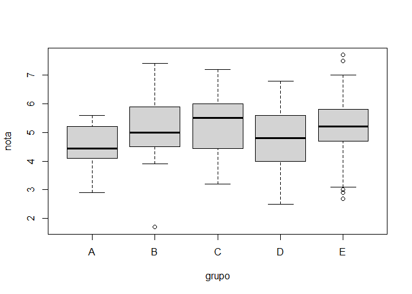
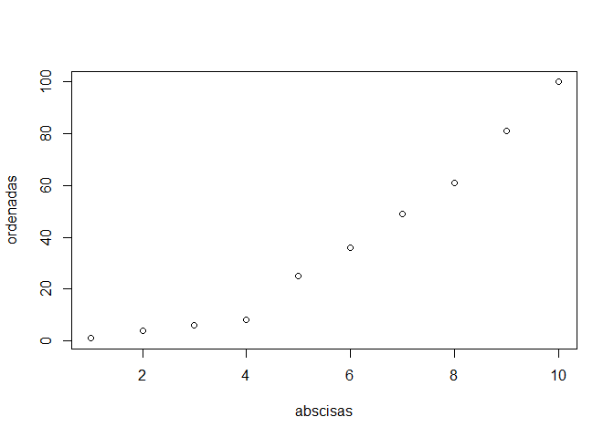
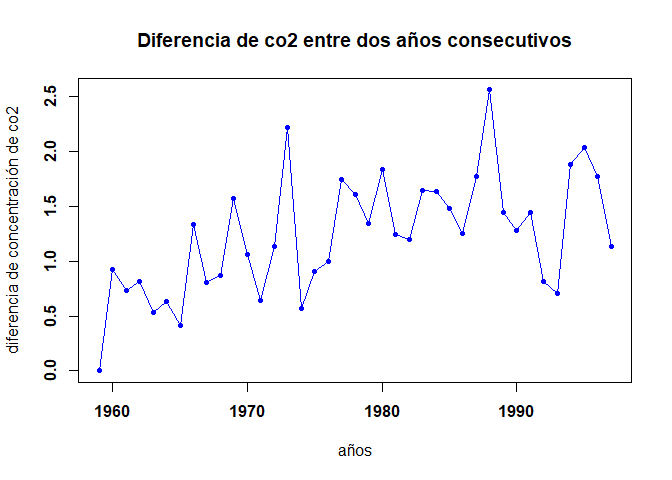
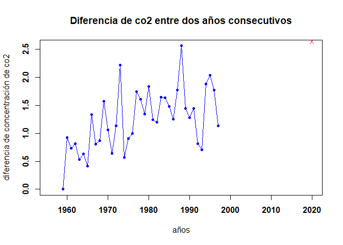

***Tarea 01***
================
GRUPO 16
*16/11/2021*

<p style="font-family: times, serif; font-size:50pt; font-style:italic">
Tarea 01
</p>

> **Integrantes**
>
> — *Campos Torres Sergio Junior*
>
> — *Montero Navarro Adrian*
>
> — *Pinedo Cienfuegos Diana Melissa*


## Parte 1

***1. Calcula los valores numéricos aproximados de***

*a.*

``` r
(0.3 * 0.15) / (0.3 * 0.15 + 0.2 * 0.8 + 0.5 * 0.12)
```

    ## [1] 0.1698113

*b.*

``` r
((5 ^ 6 )/(factorial(6)) ) *exp(-5)
```

    ## [1] 0.1462228

*c.*

``` r
(factorial(20)/(factorial(13)*factorial(7)))*0.4^7*0.6^13
```

    ## [1] 0.1658823

***2. Realizar la siguiente suma***

*a. 1+2+3+…+1000*

``` r
sum(seq(1:1000))
```

    ## [1] 500500

*b. 1+2+4+8+16+…+1024*

``` r
1+sum(2^seq(0:10))
```

    ## [1] 4095

***3. El vector grupo representa el grupo al que pertenece una serie de
alumnos***

*a. ¿Cuántos elementos tiene?*

``` r
load(url("https://goo.gl/uDzU8v"))
length(grupo)
```

    ## [1] 192

*b. ¿En qué posiciones del vector está la letra “A?”*

``` r
which(grupo=="A")
```

    ##  [1]   2   8  17  21  28  84 101 108 111 115 123 136 190 192

***4. El vector nota representa la nota de un examen de los alumnos que
están en los grupos del vector grupo***

*a. ¿Cuánto suman todas las notas?*

``` r
sum(nota)
```

    ## [1] 962

*b. ¿Cuál es la media aritmética de todas las notas?*

``` r
mean(nota)
```

    ## [1] 5.010417

*c. ¿En qué posiciones están las notas mayores de 7.0?*

``` r
which(nota>7)
```

    ## [1]  81 103 120 151

*d. Visualiza las notas ordenadas de mayor a menor*

``` r
notasordenadas<-order(nota,na.last=TRUE,decreasing=TRUE)
nota[notasordenadas]
```

    ##   [1] 7.7 7.5 7.4 7.2 7.0 6.9 6.9 6.8 6.8 6.8 6.8 6.8 6.6 6.5 6.4 6.4 6.4 6.4
    ##  [19] 6.3 6.2 6.2 6.2 6.2 6.2 6.2 6.1 6.1 6.1 6.1 6.0 6.0 6.0 6.0 6.0 6.0 5.9
    ##  [37] 5.9 5.9 5.9 5.9 5.9 5.9 5.9 5.9 5.8 5.8 5.8 5.8 5.8 5.7 5.7 5.7 5.7 5.7
    ##  [55] 5.6 5.6 5.6 5.6 5.6 5.6 5.5 5.5 5.5 5.5 5.5 5.5 5.5 5.5 5.5 5.5 5.5 5.5
    ##  [73] 5.5 5.4 5.4 5.4 5.4 5.4 5.4 5.4 5.4 5.3 5.3 5.3 5.3 5.2 5.2 5.2 5.2 5.2
    ##  [91] 5.2 5.2 5.1 5.0 5.0 5.0 5.0 5.0 5.0 5.0 5.0 5.0 4.9 4.9 4.9 4.9 4.9 4.9
    ## [109] 4.8 4.8 4.8 4.8 4.8 4.8 4.7 4.7 4.7 4.7 4.7 4.7 4.7 4.7 4.7 4.7 4.6 4.6
    ## [127] 4.6 4.6 4.5 4.5 4.5 4.5 4.5 4.5 4.4 4.4 4.4 4.4 4.4 4.4 4.4 4.3 4.3 4.3
    ## [145] 4.2 4.2 4.2 4.2 4.2 4.2 4.2 4.2 4.1 4.1 4.1 4.1 4.1 4.0 4.0 4.0 4.0 4.0
    ## [163] 4.0 3.9 3.9 3.8 3.8 3.8 3.7 3.7 3.7 3.7 3.6 3.6 3.6 3.5 3.4 3.4 3.4 3.4
    ## [181] 3.2 3.2 3.2 3.1 3.0 2.9 2.9 2.9 2.7 2.6 2.5 1.7

*e. ¿En qué posición está la nota máxima?*

``` r
match(max(nota),nota)
```

    ## [1] 120

***5. A partir de los vectores grupo y nota definidos.***

``` r
v1=data.frame(grupo=c(grupo),nota=c(nota))
```

*a. Suma las notas de los 10 primeros alumnos del vector*

``` r
sum(nota[1:10])
```

    ## [1] 51.8

*b. ¿Cuántos alumnos hay del grupo C?*

``` r
length(nota[grupo=='C'])
```

    ## [1] 39

*c. Cuantos alumnos han aprobado*

``` r
length(nota[nota>5])
```

    ## [1] 93

*d. Cuantos alumnos del grupo B han aprobado*

``` r
length(nota[grupo=='B'&nota>5])
```

    ## [1] 10

*e. Porcentaje de alumnos del grupo C han aprobado*

``` r
AprobadosC=c(length(nota[grupo=='C'&nota>5]))
TotalC=length(nota[grupo=='C'])

(AprobadosC/TotalC)*100
```

    ## [1] 56.41026

*f. De qué grupos son la máxima y mínima notas de toda la muestra*

``` r
max(nota)
```

    ## [1] 7.7

``` r
min(nota)
```

    ## [1] 1.7

``` r
v1[v1$nota==max(nota),]
```

    ##     grupo nota
    ## 120     E  7.7

``` r
v1[v1$nota==min(nota),]
```

    ##     grupo nota
    ## 142     B  1.7

*g. Nota media de los alumnos de grupo A y B, juntos, considerando sólo
a los que han aprobado*

``` r
mean(nota[grupo=='B'&nota>5])
```

    ## [1] 6.15

``` r
mean(nota[grupo=='A'&nota>5])
```

    ## [1] 5.425

``` r
mean(c(nota[grupo=='B'&nota>5],nota[grupo=='A'&nota>5]))
```

    ## [1] 5.942857

***6. Calcula el percentil 66 de las notas de todos los alumnos, y
también de los alumnos del grupo C***

``` r
quantile(nota, 66/100)
```

    ## 66% 
    ## 5.5

*Alumnos del grupo C*

``` r
data.alumnos <- data.frame(grupo,nota) 
soloC <- data.alumnos[(data.alumnos$grupo == "C"),]
quantile(soloC$nota, 66/100)
```

    ##   66% 
    ## 5.808

***7. Un alumno tiene una nota de 4.9. ¿Qué porcentaje, del total de
alumnos, tiene una nota menor o igual que la suya? ¿Y qué porcentaje
tiene una nota mayor o igual que la suya?***

``` r
MAYOR=length(nota[nota>=4.9])
MENOR=length(nota[nota<=4.9])
TOTAL=length(nota)

(MAYOR/TOTAL)*100
```

    ## [1] 56.25

``` r
(MENOR/TOTAL)*100
```

    ## [1] 46.875

``` r
(MENOR/TOTAL)*100
```

    ## [1] 46.875

***8. Realiza el gráfico de diagramas de caja de las notas de cada
grupo, para poder comparar el nivel de cada uno de ellos.***

``` r
load(url("https://goo.gl/uDzU8v"))
boxplot(nota~grupo)
```

<!-- -->

***9. Si la variable conc recoge la concentración de plomo (en ppm) en
el aire de cierta zona durante un día completo***

``` r
H=c(0:23)
ppm=c(30:53)
conc<-data.frame(H,ppm)
```

*a. ¿Cuál ha sido la concentración máxima?*

``` r
max(conc$ppm)
```

    ## [1] 53

*b. En cuántos de los muestreos se ha superado la concentración de 40.0
ppm?*

``` r
which(conc$ppm>40)
```

    ##  [1] 12 13 14 15 16 17 18 19 20 21 22 23 24

*c. ¿Cuál ha sido la concentración media del día?*

``` r
mean(conc$ppm)
```

    ## [1] 41.5

*d. ¿Cuáles fueron las 10 mediciones más bajas del día?*

``` r
menconc=order(conc$ppm,na.last = TRUE,decreasing = TRUE)
conc$ppm[tail(menconc, 10)]
```

    ##  [1] 39 38 37 36 35 34 33 32 31 30

*e. Si la primera medida fue a las 00:00. ¿A qué hora del día se alcanzó
la concentración máxima?*

``` r
conc
```

    ##     H ppm
    ## 1   0  30
    ## 2   1  31
    ## 3   2  32
    ## 4   3  33
    ## 5   4  34
    ## 6   5  35
    ## 7   6  36
    ## 8   7  37
    ## 9   8  38
    ## 10  9  39
    ## 11 10  40
    ## 12 11  41
    ## 13 12  42
    ## 14 13  43
    ## 15 14  44
    ## 16 15  45
    ## 17 16  46
    ## 18 17  47
    ## 19 18  48
    ## 20 19  49
    ## 21 20  50
    ## 22 21  51
    ## 23 22  52
    ## 24 23  53

``` r
seq(0,24-24/288,24/288)
```

    ##   [1]  0.00000000  0.08333333  0.16666667  0.25000000  0.33333333  0.41666667
    ##   [7]  0.50000000  0.58333333  0.66666667  0.75000000  0.83333333  0.91666667
    ##  [13]  1.00000000  1.08333333  1.16666667  1.25000000  1.33333333  1.41666667
    ##  [19]  1.50000000  1.58333333  1.66666667  1.75000000  1.83333333  1.91666667
    ##  [25]  2.00000000  2.08333333  2.16666667  2.25000000  2.33333333  2.41666667
    ##  [31]  2.50000000  2.58333333  2.66666667  2.75000000  2.83333333  2.91666667
    ##  [37]  3.00000000  3.08333333  3.16666667  3.25000000  3.33333333  3.41666667
    ##  [43]  3.50000000  3.58333333  3.66666667  3.75000000  3.83333333  3.91666667
    ##  [49]  4.00000000  4.08333333  4.16666667  4.25000000  4.33333333  4.41666667
    ##  [55]  4.50000000  4.58333333  4.66666667  4.75000000  4.83333333  4.91666667
    ##  [61]  5.00000000  5.08333333  5.16666667  5.25000000  5.33333333  5.41666667
    ##  [67]  5.50000000  5.58333333  5.66666667  5.75000000  5.83333333  5.91666667
    ##  [73]  6.00000000  6.08333333  6.16666667  6.25000000  6.33333333  6.41666667
    ##  [79]  6.50000000  6.58333333  6.66666667  6.75000000  6.83333333  6.91666667
    ##  [85]  7.00000000  7.08333333  7.16666667  7.25000000  7.33333333  7.41666667
    ##  [91]  7.50000000  7.58333333  7.66666667  7.75000000  7.83333333  7.91666667
    ##  [97]  8.00000000  8.08333333  8.16666667  8.25000000  8.33333333  8.41666667
    ## [103]  8.50000000  8.58333333  8.66666667  8.75000000  8.83333333  8.91666667
    ## [109]  9.00000000  9.08333333  9.16666667  9.25000000  9.33333333  9.41666667
    ## [115]  9.50000000  9.58333333  9.66666667  9.75000000  9.83333333  9.91666667
    ## [121] 10.00000000 10.08333333 10.16666667 10.25000000 10.33333333 10.41666667
    ## [127] 10.50000000 10.58333333 10.66666667 10.75000000 10.83333333 10.91666667
    ## [133] 11.00000000 11.08333333 11.16666667 11.25000000 11.33333333 11.41666667
    ## [139] 11.50000000 11.58333333 11.66666667 11.75000000 11.83333333 11.91666667
    ## [145] 12.00000000 12.08333333 12.16666667 12.25000000 12.33333333 12.41666667
    ## [151] 12.50000000 12.58333333 12.66666667 12.75000000 12.83333333 12.91666667
    ## [157] 13.00000000 13.08333333 13.16666667 13.25000000 13.33333333 13.41666667
    ## [163] 13.50000000 13.58333333 13.66666667 13.75000000 13.83333333 13.91666667
    ## [169] 14.00000000 14.08333333 14.16666667 14.25000000 14.33333333 14.41666667
    ## [175] 14.50000000 14.58333333 14.66666667 14.75000000 14.83333333 14.91666667
    ## [181] 15.00000000 15.08333333 15.16666667 15.25000000 15.33333333 15.41666667
    ## [187] 15.50000000 15.58333333 15.66666667 15.75000000 15.83333333 15.91666667
    ## [193] 16.00000000 16.08333333 16.16666667 16.25000000 16.33333333 16.41666667
    ## [199] 16.50000000 16.58333333 16.66666667 16.75000000 16.83333333 16.91666667
    ## [205] 17.00000000 17.08333333 17.16666667 17.25000000 17.33333333 17.41666667
    ## [211] 17.50000000 17.58333333 17.66666667 17.75000000 17.83333333 17.91666667
    ## [217] 18.00000000 18.08333333 18.16666667 18.25000000 18.33333333 18.41666667
    ## [223] 18.50000000 18.58333333 18.66666667 18.75000000 18.83333333 18.91666667
    ## [229] 19.00000000 19.08333333 19.16666667 19.25000000 19.33333333 19.41666667
    ## [235] 19.50000000 19.58333333 19.66666667 19.75000000 19.83333333 19.91666667
    ## [241] 20.00000000 20.08333333 20.16666667 20.25000000 20.33333333 20.41666667
    ## [247] 20.50000000 20.58333333 20.66666667 20.75000000 20.83333333 20.91666667
    ## [253] 21.00000000 21.08333333 21.16666667 21.25000000 21.33333333 21.41666667
    ## [259] 21.50000000 21.58333333 21.66666667 21.75000000 21.83333333 21.91666667
    ## [265] 22.00000000 22.08333333 22.16666667 22.25000000 22.33333333 22.41666667
    ## [271] 22.50000000 22.58333333 22.66666667 22.75000000 22.83333333 22.91666667
    ## [277] 23.00000000 23.08333333 23.16666667 23.25000000 23.33333333 23.41666667
    ## [283] 23.50000000 23.58333333 23.66666667 23.75000000 23.83333333 23.91666667

``` r
horas=c(seq(0,24-24/288,24/288))
df_plomo=data.frame(conc, horas)
df_plomo$horas[(max(conc)==df_plomo$conc)]
```

    ## numeric(0)

## Parte 2

***1. Graficar los puntos
(1,1),(2,4),(3,6),(4,8),(5,25),(6,36),(7,49),(8,61),(9,81),(10,100) en
un plano usado Rstudio***

``` r
abscisas<-c(1,2,3,4,5,6,7,8,9,10)
ordenadas<-c(1,4,6,8,25,36,49,61,81,100)
plot(x=abscisas,y=ordenadas)
```

<!-- --> ***2.
Ingresar la matriz A en RStudio***

``` r
vect1<-c(1, 2, 3, 4, 2, 4, 6, 8, 3, 6, 9, 12)
A=matrix(data = vect1, nrow = 4, ncol = 3)
```

***3. Ingresar la matriz identidad de tamaño 3***

``` r
diag(1,3,3)
```

    ##      [,1] [,2] [,3]
    ## [1,]    1    0    0
    ## [2,]    0    1    0
    ## [3,]    0    0    1

``` r
diag(3)
```

    ##      [,1] [,2] [,3]
    ## [1,]    1    0    0
    ## [2,]    0    1    0
    ## [3,]    0    0    1

***4. Crea una función que cree una matriz nula ingresando las
dimensiones***

``` r
matrixnula<-function(x,y) {
  matrix(0,x,y)
}
```

***5. Modificar la matriz diag(4), para que se parezca a la matriz B***

``` r
vec3<-c(0, 2, 3, 4)
diag(x =vec3, nrow = 4, ncol = 4)
```

    ##      [,1] [,2] [,3] [,4]
    ## [1,]    0    0    0    0
    ## [2,]    0    2    0    0
    ## [3,]    0    0    3    0
    ## [4,]    0    0    0    4

``` r
B=diag(x =vec3, nrow = 4, ncol = 4)
```

***6. Obtener la matriz transpuesta de A (ejercicio 2)***

``` r
t(A)
```

    ##      [,1] [,2] [,3] [,4]
    ## [1,]    1    2    3    4
    ## [2,]    2    4    6    8
    ## [3,]    3    6    9   12

***7. Realizar las siguientes operaciones A+B, A-B, 3B y AB***

``` r
#Matriz A
A=matrix(data = vect1, nrow = 4, ncol = 3)

#Matriz B
B=diag(x =vec3, nrow = 4, ncol = 4)

#Las operaciones A+B, A-B Y AB no cumplen con las condiciones necesarias por tener diferente numero de columnas.

3*B
```

    ##      [,1] [,2] [,3] [,4]
    ## [1,]    0    0    0    0
    ## [2,]    0    6    0    0
    ## [3,]    0    0    9    0
    ## [4,]    0    0    0   12

***8. Crea una función para calcular P6***

``` r
mt<-c(1,-2,1,2,4,0,3,-2,1)
P<-matrix(mt,3)
fun<- function(x){
  (((((x%*%x)%*%x)%*%x)%*%x)%*%x)
}
fun(P)
```

    ##       [,1]  [,2]  [,3]
    ## [1,] -1792    24 -2824
    ## [2,]  -464 -2416 -1344
    ## [3,]  -648   440  -912

***9. Resolver el sistema de ecuaciones*** **3x-y+z=-1** **9x-2y+z=-9**
**3x+y-2z=-9**

``` r
A=cbind(c(3,9,3),c(-1,-2,1),c(1,1,-2))
B=c(-1,-9,-9)
solve(A,B)
```

    ## [1] -1  2  4

***10. Utilizando la ayuda de R, investigue para qué sirven las
funciones eigen() y det()***

**Usando “help(det)” descubrimos que sirve para hallar por separado el
modulo del determinante de una matriz**

``` r
mtrx=matrix(c(0,2,1,4,1,3,2,0,1),3,3)
det(mtrx)
```

    ## [1] 2

**Usando “help(eigen)” descubrimos que sirve para hallar por separado
los valores y vectores propios de una matriz**

``` r
eigen(mtrx)
```

    ## eigen() decomposition
    ## $values
    ## [1]  4.236068 -2.000000 -0.236068
    ## 
    ## $vectors
    ##           [,1]       [,2]       [,3]
    ## [1,] 0.6804406  0.8017837  0.2737911
    ## [2,] 0.4205354 -0.5345225 -0.4430033
    ## [3,] 0.6001255  0.2672612  0.8536899

***11. Considerando las matrices A Y B, hallar BA-BA^t***

``` r
v <- (1:10)
v2 <- v*2
v3 <- v*3
v4 <- v*4
v5 <- v*5
B <- matrix(c(v,v2,v3,v4,v5),10)
X <- c(0,1,0,0,1,1,0,1,1,0,0,1,0,0,1,1,0,1,0,1,0,1,0,1,0)
A <- matrix(X,5)
B%*%A - B%*%t(A)
```

    ##       [,1] [,2] [,3] [,4] [,5]
    ##  [1,]    1   -1    1    2   -2
    ##  [2,]    2   -2    2    4   -4
    ##  [3,]    3   -3    3    6   -6
    ##  [4,]    4   -4    4    8   -8
    ##  [5,]    5   -5    5   10  -10
    ##  [6,]    6   -6    6   12  -12
    ##  [7,]    7   -7    7   14  -14
    ##  [8,]    8   -8    8   16  -16
    ##  [9,]    9   -9    9   18  -18
    ## [10,]   10  -10   10   20  -20

***12. Considere β = ( X^t * X )^-1 \* X^t \* Y**\*

``` r
x<-matrix(c(1,1,1,1,1,1,-1,0,1,2),nrow=5,ncol=2)
y<-matrix(c(0,0,1,1,3),nrow = 5,ncol = 1)

#Las operacion correcta seria "(solve(t(x)%%x)%%t(x))%*%y" no cumplen con las condiciones necesarias debido a que sus dimensiones no son las adecuadas para definir la operación
```

***13. Corre el siguiente código para cargar los vectores year y co2 en
memoria***

``` r
data(co2)
means = aggregate(co2, FUN=mean)
year = as.vector(time(means))
co2 = as.vector(means)
```

*a. El vector co2 contiene medidas de CO2 en la atmósfera, en unidades
de ppm, durante el periodo 1959-1997. El vector year contiene sus años
correspondientes*

``` r
co2
```

    ##  [1] 315.8258 316.7475 317.4850 318.2975 318.8325 319.4625 319.8725 321.2100
    ##  [9] 322.0200 322.8900 324.4592 325.5175 326.1550 327.2933 329.5117 330.0792
    ## [17] 330.9858 331.9858 333.7300 335.3358 336.6808 338.5150 339.7608 340.9592
    ## [25] 342.6083 344.2467 345.7258 346.9750 348.7508 351.3133 352.7542 354.0367
    ## [33] 355.4783 356.2917 356.9958 358.8800 360.9142 362.6867 363.8175

``` r
year
```

    ##  [1] 1959 1960 1961 1962 1963 1964 1965 1966 1967 1968 1969 1970 1971 1972 1973
    ## [16] 1974 1975 1976 1977 1978 1979 1980 1981 1982 1983 1984 1985 1986 1987 1988
    ## [31] 1989 1990 1991 1992 1993 1994 1995 1996 1997

*b. Calcular un vector de diferencias de CO2 entre años consecutivos,
que sería:* *CO2 en 1960 menos CO2 en 1959* *CO2 en 1961 menos CO2 en
1960* *y así sucesivamente…*

``` r
diff(co2)
```

    ##  [1] 0.9216667 0.7375000 0.8125000 0.5350000 0.6300000 0.4100000 1.3375000
    ##  [8] 0.8100000 0.8700000 1.5691667 1.0583333 0.6375000 1.1383333 2.2183333
    ## [15] 0.5675000 0.9066667 1.0000000 1.7441667 1.6058333 1.3450000 1.8341667
    ## [22] 1.2458333 1.1983333 1.6491667 1.6383333 1.4791667 1.2491667 1.7758333
    ## [29] 2.5625000 1.4408333 1.2825000 1.4416667 0.8133333 0.7041667 1.8841667
    ## [36] 2.0341667 1.7725000 1.1308333

``` r
y <- c(0,diff(co2))
y
```

    ##  [1] 0.0000000 0.9216667 0.7375000 0.8125000 0.5350000 0.6300000 0.4100000
    ##  [8] 1.3375000 0.8100000 0.8700000 1.5691667 1.0583333 0.6375000 1.1383333
    ## [15] 2.2183333 0.5675000 0.9066667 1.0000000 1.7441667 1.6058333 1.3450000
    ## [22] 1.8341667 1.2458333 1.1983333 1.6491667 1.6383333 1.4791667 1.2491667
    ## [29] 1.7758333 2.5625000 1.4408333 1.2825000 1.4416667 0.8133333 0.7041667
    ## [36] 1.8841667 2.0341667 1.7725000 1.1308333

*c. Crear un plot con lineas y puntos mostrando las diferencias
consecutivas de CO2 en función del tiempo (1960, 1961, etc…), en
negrita*

``` r
plot(year, y, type="o", pch=20, xlab="años", ylab="diferencia de concentración de co2", main="Diferencia de co2 entre dos años consecutivos", col="blue", font=2)
```

<!-- --> *d. La
diferencia de concentración de CO2 entre 2020 y 2019 fue igual a 2.64.
Agregar un punto rojo representando esa diferencia al plot ya creado
(usar una forma diferente, como pch=4)*

``` r
plot(year, y, xlim=c(1956, 2020), type="o", pch=20, xlab="años", ylab="diferencia de concentración de co2", main="Diferencia de co2 entre dos años consecutivos", col="blue", font=2)
points(2020, 2.64, pch=4, col="red")
```

<!-- -->

***14. Lee el archivo rainfall.csv como un data.frame. Calcula e imprime
un vector con los nombres de las estaciones donde al menos uno de los
meses tiene una precipitación superior a 180mm***

``` r
df=read.csv("D:/Progra/rainfall.csv")

df[(df$sep>180)|(df$oct>180)|(df$nov>180)|(df$dec>180)|(df$jan>180)|(df$feb>180)|(df$mar>180)|(df$apr>180)|(df$may>180),]
```

    ##        num altitude sep oct nov dec jan feb mar apr  may       name    x_utm
    ## 66 2496029      940 1.9  22  86 159 201 196 115  40  9.1 Golan Farm 761589.2
    ## 71  210748      300 3.7  36 112 160 201 153  92  34  9.5      Eilon 706938.1
    ## 72  210902      600 2.6  35 106 162 205 179 106  35  7.8    Fasutta 715879.5
    ## 73  211350      380 2.3  36 115 169 204 160  95  32  9.1     Yehiam 708299.6
    ## 74  211415      480 3.2  30 112 170 209 183 105  35  8.3 Kfar Mahol 716009.6
    ## 75  211600      680 2.3  28 100 171 220 192 109  34  7.6      Meron 727711.5
    ## 77  212168      825 3.4  37 122 202 238 190 114  38 12.2   Horashim 717491.2
    ##      y_utm
    ## 66 3669108
    ## 71 3660756
    ## 72 3658943
    ## 73 3653081
    ## 74 3652743
    ## 75 3652888
    ## 77 3648872

``` r
M=df[(df$sep>180)|(df$oct>180)|(df$nov>180)|(df$dec>180)|(df$jan>180)|(df$feb>180)|(df$mar>180)|(df$apr>180)|(df$may>180),]

c((M$name))
```

    ## [1] "Golan Farm" "Eilon"      "Fasutta"    "Yehiam"     "Kfar Mahol"
    ## [6] "Meron"      "Horashim"


